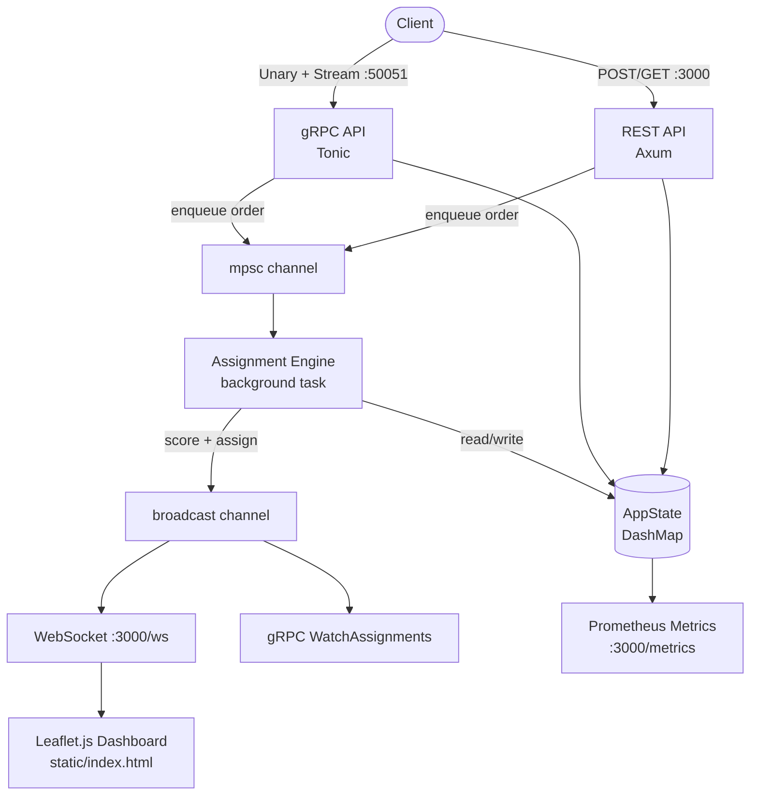

# dispatch-router

Real-time delivery assignment service that matches incoming orders to the best available courier using a weighted scoring algorithm.

Built with Rust, exposing both REST and gRPC APIs, a WebSocket-powered live dashboard, and Prometheus metrics.

## How it works

When an order comes in, the engine filters couriers that are `Available` and have capacity, then scores each one:

| Factor | Weight | Formula |
|--------|--------|---------|
| Distance | 40% | `1 / (1 + km)` — closer to pickup wins |
| Load | 30% | `1 - (current_load / capacity)` — less loaded wins |
| Rating | 20% | `rating / 5.0` — higher rated wins |
| Priority | 10% | Urgent=1.0, High=0.85, Normal=0.7, Low=0.5 |

The highest-scoring courier gets the assignment. If no couriers are available, the order is re-queued.

All state is in-memory (`DashMap`). No database required — data resets on restart.

## Architecture



## Quick start

```bash
# Prerequisites: Rust 1.85+, protoc
cp .env.example .env
cargo run
```


## REST API

You can open another terminal and paste this commands to test, you'll see changes happening on dashboard in `http://localhost:3000/` .

```bash
# Create a courier
curl -X POST http://localhost:3000/couriers \
  -H "Content-Type: application/json" \
  -d '{"name":"Max","location":{"lat":52.52,"lng":13.405},"capacity":5,"rating":4.8}'

# List couriers
curl http://localhost:3000/couriers

# Update courier status
curl -X PATCH http://localhost:3000/couriers/{id}/status \
  -H "Content-Type: application/json" \
  -d '{"status":"Offline"}'

# Update courier location
curl -X PATCH http://localhost:3000/couriers/{id}/location \
  -H "Content-Type: application/json" \
  -d '{"location":{"lat":52.53,"lng":13.41}}'

# Create an order (triggers assignment)
curl -X POST http://localhost:3000/orders \
  -H "Content-Type: application/json" \
  -d '{"pickup":{"lat":52.51,"lng":13.39},"dropoff":{"lat":52.54,"lng":13.42},"priority":"Urgent"}'

# Get order by ID
curl http://localhost:3000/orders/{id}

# List assignments
curl http://localhost:3000/assignments

# Health check
curl http://localhost:3000/health
```

## gRPC

Defined in `proto/dispatch.proto`. Five RPCs:

| RPC | Type | Description |
|-----|------|-------------|
| `CreateCourier` | Unary | Register a courier |
| `GetCouriers` | Unary | List all couriers |
| `CreateOrder` | Unary | Submit an order for assignment |
| `GetAssignments` | Unary | List all assignments |
| `WatchAssignments` | Server stream | Live assignment events |

```bash
# Requires grpcurl
grpcurl -plaintext -import-path proto -proto dispatch.proto \
  -d '{"name":"Max","location":{"lat":52.52,"lng":13.405},"capacity":5,"rating":4.8}' \
  localhost:50051 dispatch.DispatchService/CreateCourier

# Stream live assignments
grpcurl -plaintext -import-path proto -proto dispatch.proto \
  localhost:50051 dispatch.DispatchService/WatchAssignments
```

## Metrics

`GET /metrics` returns Prometheus format:

- `assignments_total{outcome}` — counter by success/error
- `assignment_latency_seconds{outcome}` — histogram
- `orders_in_queue` — gauge
- `courier_utilization{courier_id}` — gauge [0..1]

## Tests

```bash
cargo test
```

5 unit tests (haversine, scoring) + 12 integration tests (full HTTP API).

## Configuration

Via `.env` or environment variables:

| Variable | Default | Description |
|----------|---------|-------------|
| `HTTP_PORT` | 3000 | REST + WebSocket + dashboard |
| `GRPC_PORT` | 50051 | gRPC server |
| `LOG_LEVEL` | info | tracing filter |
| `ORDER_QUEUE_SIZE` | 1024 | mpsc channel buffer |
| `EVENT_BUFFER_SIZE` | 1024 | broadcast channel buffer |


## Stack

Rust, Tokio, Axum, Tonic, Prost, DashMap, Prometheus, Leaflet.js
